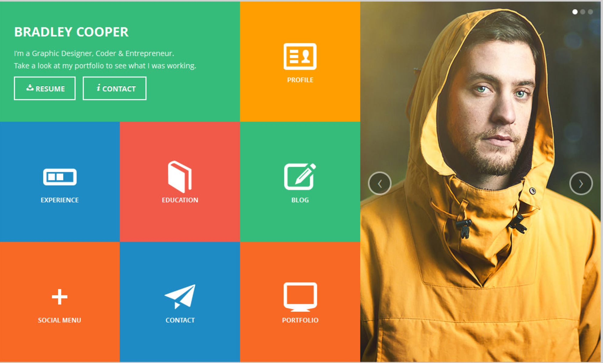

#Static Comp Challenge 1
This project incorporate basic html and css to structure and and styling.  We were tasked with including basic aesthetic design principles, responsive design to achieve a look and feel that closely matched the comp.

We were give the liberty to choose a complimentary color palette that would work well with the images we chose both.

###Images of the comp and my finished product

