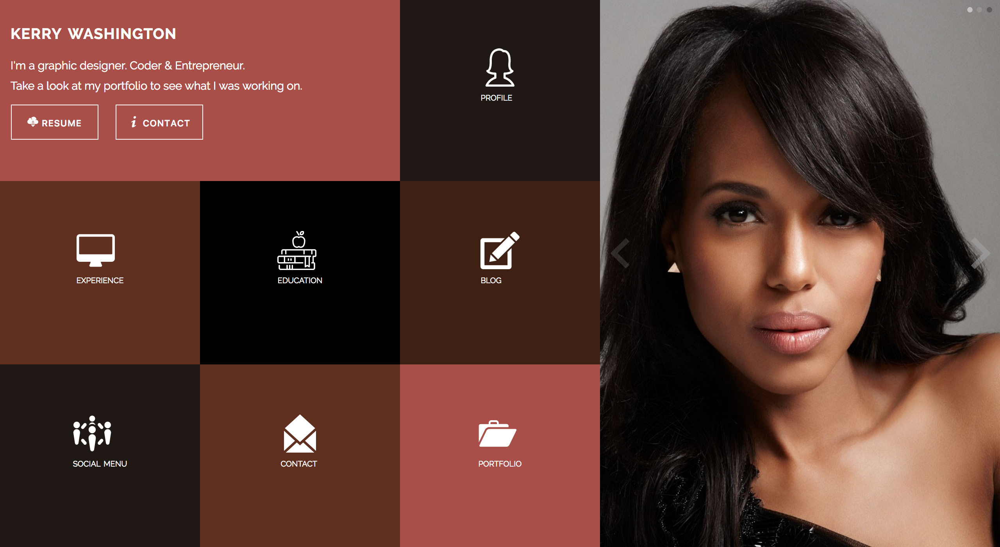

# Static Comp Challenge 1
This project incorporates a basic html structure and css for styling.  We were tasked with including basic aesthetic design principles, applying positioning techniques, and adding responsive design to achieve a look and feel that closely matches the comp.

We were given the liberty to choose a complimentary color palette that would work well with the images, icons, and Typeface we chose.

### Images of the comp and my finished product

